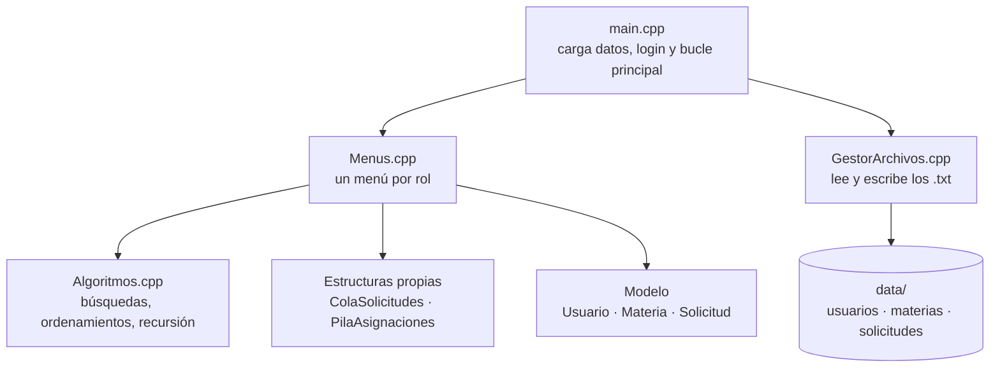
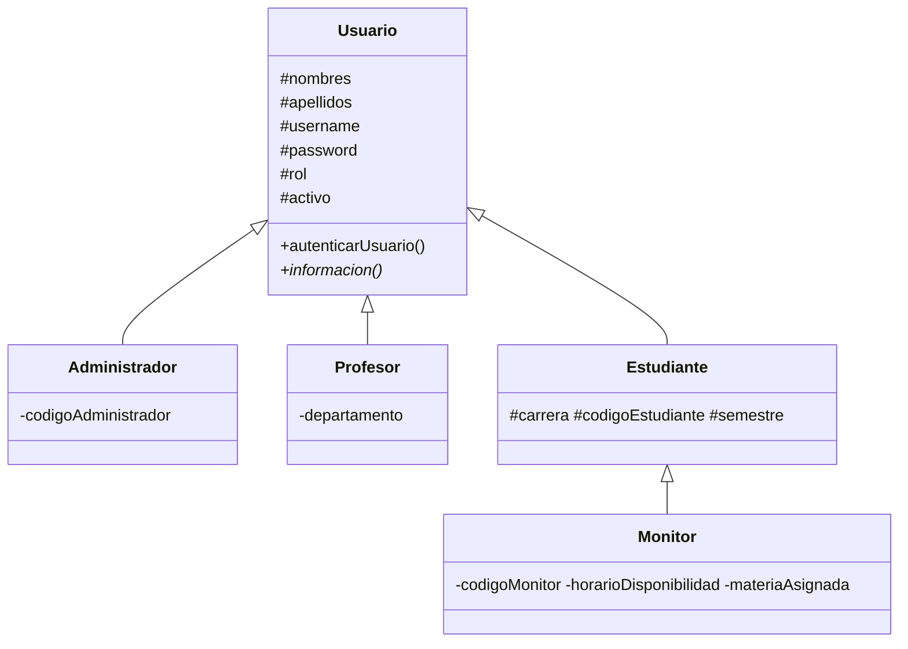
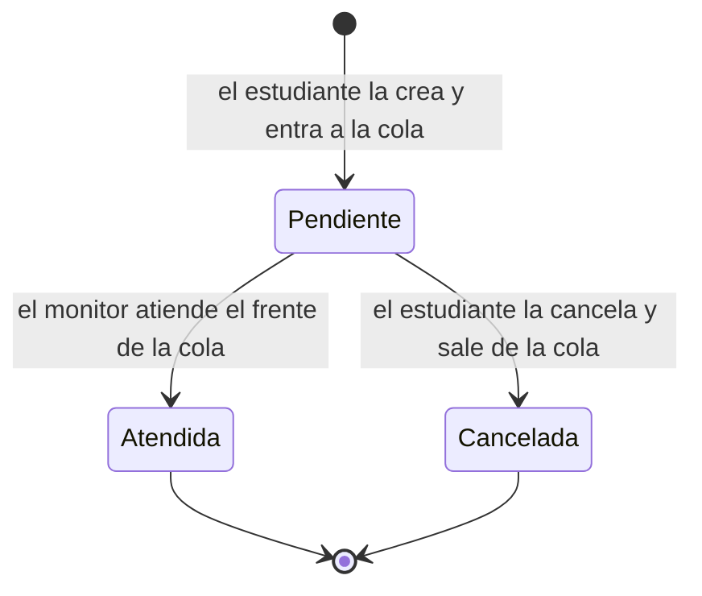

<h1 align="center"> Sistema de Acompañamiento Académico</h1>

<p align="center">
  <b>Aplicación de consola en C++ para gestionar monitorías universitarias:</b><br>
  usuarios con roles, catálogo de materias con prerrequisitos y una cola de solicitudes que atiende primero lo más urgente.<br>
  Todas las estructuras de datos (<b>pila</b> y <b>cola con prioridad</b>) y los algoritmos de <b>búsqueda</b>, <b>ordenamiento</b> y <b>recursión</b> están implementados a mano, sin usar contenedores de la STL que los resuelvan por nosotros.
</p>

<p align="center">
  
  
  
  
  
</p>

<p align="center">
  <a href="#-qué-hace">Qué hace</a> ·
  <a href="#-inicio-rápido">Inicio rápido</a> ·
  <a href="#-cómo-funciona">Cómo funciona</a> ·
  <a href="#-algoritmos-y-complejidad">Algoritmos</a> ·
  <a href="#-formato-de-los-datos">Datos</a> ·
  <a href="#-estado-de-los-requerimientos">Estado</a>
</p>

---

##  Qué hace

Una universidad ofrece monitorías: estudiantes que ayudan a otros en una materia. Este sistema organiza todo ese flujo desde la terminal:

| Rol | Qué puede hacer |
|---|---|
|  **Estudiante** | Ver materias ordenadas a su gusto, consultar prerrequisitos, **crear solicitudes de monitoría** con nivel de urgencia, ver su historial y cancelar solicitudes pendientes |
|  **Monitor** | Ver la **cola de pendientes** en orden de atención y **atender la siguiente solicitud** |
|  **Profesor** | Consultar materias, prerrequisitos, solicitudes por materia y qué monitor tiene asignada cada materia |
| **Administrador** | Registrar materias (con código autogenerado y prerrequisitos) y usuarios, buscar por código, **asignar materias a monitores** y **deshacer la última asignación** |

Los datos viven en archivos `.txt`: se cargan al iniciar y se guardan al cerrar, así que el estado sobrevive entre ejecuciones.

---

##  Inicio rápido

**Requisitos:** un compilador de C++ (`g++` con soporte C++11 o superior). En Windows se usa [MSYS2](https://www.msys2.org/) (`ucrt64`), igual que en la configuración de VS Code incluida.

```bash
# 1. Clonar
git clone <url-del-repositorio>
cd Algoritmos-2026-S2-PROYECTO

# 2. Compilar
g++ -std=c++17 -g Proyecto/src/*.cpp -o Proyecto/src/Software

# 3. Ejecutar (desde la carpeta src, o desde la raíz: el programa encuentra data/ solo)
cd Proyecto/src
./Software          # en Windows: Software.exe
```

> 💡 **Con VS Code:** abre la carpeta y presiona `F5`. La tarea `C/C++: Compilar Proyecto (Software.exe)` compila todo y el depurador `gdb` lo lanza (rutas de MSYS2 en `.vscode/`; ajústalas si instalaste el compilador en otro lugar).

### Usuarios de prueba

Al arrancar, el programa muestra estas credenciales (existen en `data/usuarios.txt`):

| Rol | Usuario | Contraseña |
|---|---|---|
| Administrador | `admin` | `admin123` |
| Estudiante | `estudiante` | `estu123` |
| Monitor | `monitor` | `mon123` |
| Profesor | `profesor` | `prof123` |

---

##  Pruébalo

Una sesión real como administrador, comparando los dos tipos de búsqueda (opción `3`, buscando `MAT101`):

```text
Seleccione una opcion: 3
Codigo a buscar: MAT101
[MAT101] Calculo Diferencial - 4 creditos (Obligatoria)
(secuencial: 4 comparaciones | binaria: 3 comparaciones)
```

Y la recursión sobre prerrequisitos (opción `4`, materia `FIS105`):

```text
Fisica diferencial:
  - FIS201 Fisica Mecanica
    - MAT101 Calculo Diferencial
```

Cada nivel de sangría es un nivel de recursión: `FIS105` exige `FIS201`, que a su vez exige `MAT101`.

Otras cosas para probar:
1. Entra como `estudiante`, crea dos solicitudes con urgencias distintas (opción `3`).
2. Entra como `monitor`, mira la cola (opción `2`) y verás que **la más urgente va primero**, aunque llegara después.
3. Entra como `admin`, asigna una materia a `monitor` (opción `6`) y deshazla (opción `7`).
4. Lista las materias con los tres algoritmos de ordenamiento y compara cuántas comparaciones hace cada uno.

---

##  Cómo funciona

### Arquitectura



`main` carga los tres archivos, ordena las materias por código (requisito de la búsqueda binaria), reconstruye la cola con las solicitudes que siguen pendientes y entra al bucle de inicio de sesión. Al salir, guarda todo y libera la memoria dinámica de los usuarios.

### Modelo de usuarios (herencia y polimorfismo)



Un **Monitor es un Estudiante** con horario y una materia asignada. Los usuarios se guardan en un único `vector<Usuario*>`; al iniciar sesión, el rol decide a qué clase se hace el `static_cast` y qué menú se abre. El registro y la persistencia usan `dynamic_cast` para distinguir tipos (probando `Monitor` antes que `Estudiante`, porque un monitor también es estudiante).

### Ciclo de vida de una solicitud



### La cola con prioridad

`ColaSolicitudes` es una cola propia (sobre un `vector`) que se mantiene **ordenada por urgencia, de mayor a menor**. Al encolar, se recorre hasta encontrar la primera posición cuyo elemento tenga urgencia *estrictamente menor* y se inserta ahí. Eso da dos garantías:

- Una solicitud **Alta** siempre pasa delante de las **Media** y **Baja**.
- Entre solicitudes de la **misma urgencia** se respeta el orden de llegada (FIFO).

Al reiniciar el programa, la cola se reconstruye a partir de las solicitudes con estado `Pendiente`.

### La pila de asignaciones

Cada vez que el administrador asigna una materia a un monitor, se apila un registro con el monitor, la materia anterior y la nueva. **Deshacer** hace `pop` y restaura la materia anterior: el comportamiento LIFO es exactamente lo que se necesita para revertir "la última" asignación, una y otra vez.

---

##  Algoritmos y complejidad

Las búsquedas y ordenamientos **cuentan sus comparaciones** y las muestran en pantalla, para poder comparar algoritmos con datos reales en lugar de solo con teoría.

| Algoritmo | Dónde se usa | Complejidad | Notas |
|---|---|---|---|
| Búsqueda secuencial | Materias y solicitudes por id | O(n) | No exige orden |
| Búsqueda binaria | Materias por código (validaciones, prerrequisitos, generación de códigos) | O(log n) | Exige el vector ordenado por código |
| Ordenamiento por **inserción** | Insertar una materia nueva en su lugar; opción del listado | O(n²) · O(n) si está casi ordenado | Básico |
| Ordenamiento **merge sort** | Orden inicial por código al arrancar; opción del listado | O(n log n) | Recursivo, usa memoria auxiliar |
| Ordenamiento **quick sort** | Opción del listado | O(n log n) promedio | Recursivo, pivote central para evitar el peor caso en datos ya ordenados |
| **Recursión** sobre prerrequisitos | Mostrar la cadena completa de prerrequisitos de una materia | O(k) con k = materias alcanzadas | Caso base: materia sin prerrequisitos |
| Encolar / desencolar | Cola de solicitudes | O(n) / O(n) · `frente` O(1) | Implementada sobre vector |
| `push` / `pop` | Pila de asignaciones | O(1) | |

Los listados admiten **tres criterios** (código, nombre o créditos) y siempre ordenan una **copia**, para no romper el orden por código que necesita la búsqueda binaria.

Detalles que cuidan la robustez: la generación de códigos (3 letras del nombre + consecutivo, p. ej. `CAL106`) verifica unicidad con búsqueda binaria; la recursión de prerrequisitos tiene un tope de profundidad para no ciclarse si los datos tuvieran una dependencia circular; y la lectura de menús valida entradas no numéricas.


##  Formato de los datos

Archivos de texto separados por comas. Las líneas vacías o que empiezan por `#` se ignoran.

**`materias.txt`**
```text
Codigo,Nombre,Creditos,Tipo,Prerrequisitos(separados por ';')
PROG201,Estructuras de Datos,3,Obligatoria,PROG102
```

**`solicitudes.txt`**
```text
Id,CodigoEstudiante,CodigoMateria,Urgencia(1-3),Estado,Descripcion
2,1,PROG102,3,Atendida,Dudas sobre polimorfismo y herencia
```
La descripción es el último campo, por lo que **sí puede contener comas**. Estados válidos: `Pendiente`, `Atendida`, `Cancelada`.

**`usuarios.txt`** — las columnas finales dependen del rol:
```text
Administrador,Nombres,Apellidos,Usuario,Clave,Activo,CodigoAdmin
Estudiante,Nombres,Apellidos,Usuario,Clave,Activo,CodigoEst,Carrera,Semestre
Monitor,Nombres,Apellidos,Usuario,Clave,Activo,CodigoEst,Carrera,Semestre,CodigoMonitor,Horario,MateriaAsignada
Profesor,Nombres,Apellidos,Usuario,Clave,Activo,Departamento
```

> El programa localiza `data/` automáticamente tanto si lo ejecutas desde `Proyecto/src/`, desde `Proyecto/` o desde la raíz del repositorio.

---

##  Estado de los requerimientos

| # | Requerimiento | Estado |
|---|---|---|
| 1 | Registro de usuarios y materias | ✅ Implementado |
| 2 | Solicitudes de monitoría e historial | ✅ Implementado |
| 3 | Cola con prioridad por urgencia | ✅ Implementado |
| 4 | Revertir la última asignación (pila) | ✅ Implementado |
| 5 | Búsqueda por código (secuencial y binaria) | ✅ Implementado |
| 6 | Ordenamientos (inserción, merge sort, quick sort) | ✅ Implementado |
| 7 | Jerarquía de materias por área y nivel | 🚧 Pendiente |
| 8 | Grafo de prerrequisitos | 🚧 En diseño: hoy se recorren recursivamente desde cada materia; `Grafo.h` es solo el concepto |
| 9 | Agenda semanal sin cruces e informe de cobertura | 🚧 Pendiente |

Requisitos transversales del curso: al menos un algoritmo **recursivo** aplicado al dominio ✅ · búsqueda **secuencial y binaria** ✅ · **tres** ordenamientos (uno básico, dos avanzados) ✅ · **pila y cola propias** ✅.

---

##  Limitaciones conocidas

- Las contraseñas se guardan en **texto plano** en `usuarios.txt` (es un proyecto académico; no uses credenciales reales).
- Los campos de texto **no admiten comas** (la coma es el separador), salvo la descripción de las solicitudes.
- El historial de asignaciones (la pila) **no se persiste**: la asignación sí queda guardada, pero tras reiniciar ya no se puede deshacer.
- Un monitor atiende el frente de la cola **sin filtrar** por su materia asignada.
- La cola usa un `vector`, así que encolar y desencolar son O(n); una lista enlazada o un heap mejorarían eso.

---

## Próximos pasos

- [ ] Árbol de materias por área y nivel
- [ ] Grafo dirigido de prerrequisitos (arista `A → B` cuando A es prerrequisito de B) con detección de ciclos
- [ ] Agenda semanal de monitores sin cruces de horario
- [ ] Informe de cobertura: qué materias tienen monitor y cuáles no
- [ ] Filtrar la cola según la materia asignada al monitor

---

<p align="center">
  Proyecto del curso <b>Algoritmos y Estructuras de Datos</b> · 2026-S2
  </b> Julian Hernandez Y </b> 
  David Arteaga
</p>
